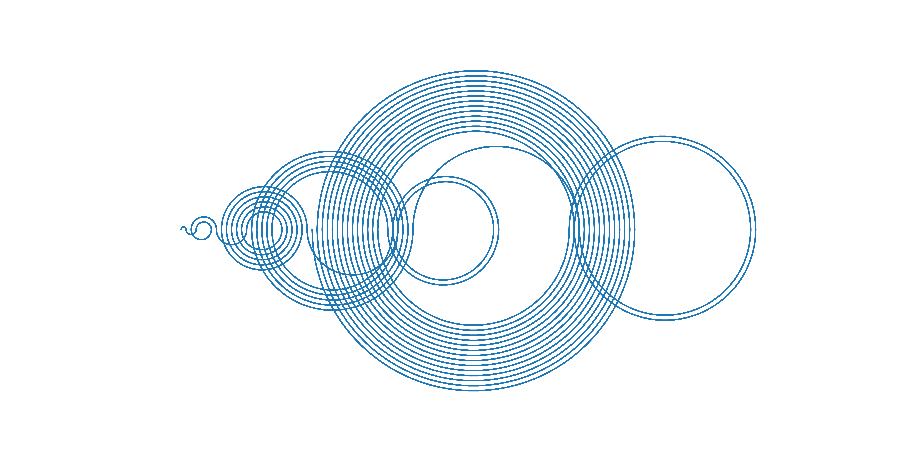
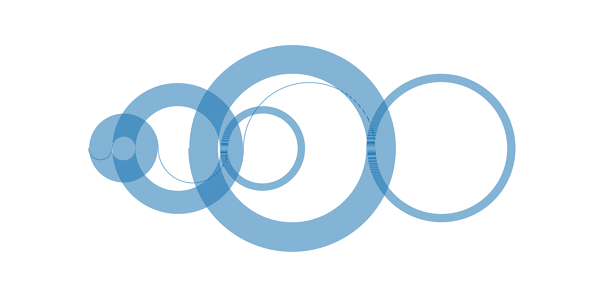

# Generalised Recaman sequences

By changing the starting number, the starting skip size and the skip increment,
you can produce an infinite variety of patterns, many of which have interesting
characteristics of their own.

The idea of plotting these in semicircular loops comes from this Numberphile
video: https://www.youtube.com/watch?v=FGC5TdIiT9U

Some more information at Wikipedia: https://en.wikipedia.org/wiki/Recamán%27s_sequence

To play with the code on Google Colab, use this link:

https://colab.research.google.com/github/ben-willmore/recaman/blob/master/recaman-examples-1.ipynb

